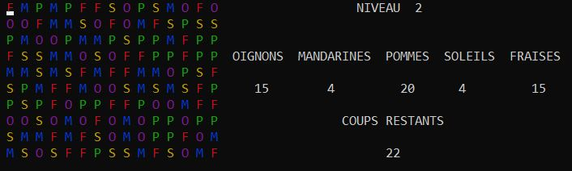
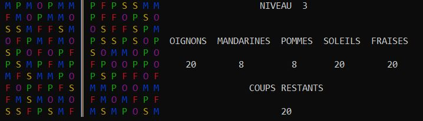

# Plantamiz
Plantamiz is a match-three puzzle video game implemented in C. The project consists of programming a simplified adaptation of the well-known game Farm Heroes Saga.

### Context 

During our first academic year, we have been assigned a to design and create Plantamiz, is a match-three puzzle video game like *Candy Crush Saga* or *Farm Heroes Saga*. 

## Authors

* **Nicolas Gorrity** - *Initial work* - [GitHub](https://github.com/nicolasgorrity) [LinkedIn](https://www.linkedin.com/in/ngorrity/)
* **Fabien Roussel** - *Initial work* - [GitHub](https://github.com/FabienRoussel) [LinkedIn](https://www.linkedin.com/in/fabien-roussel/)

## Rules and constraints

A matrix of dimensions (10x15) with different items is presented to you. The goal of the game is to pass the last level: level 4.

To pass a level, the contract displayed on the screen must be filled in a limited number of moves. It is therefore necessary to obtain as many item points as the contract indicates. To gain these points, it is necessary to create combinations by aligning horizontally or vertically at least 3 identical items.



When a combination is created, it fades and the remaining items fall by gravity to fill the matrix. The creation of combinations is done by permutation of the items. A move is equivalent to a permutation. Two items can be switched even if it does not lead to the formation of a combination.

A specific point counting system is put in place. For three aligned items, the player earns three item points. For four items aligned, the player gains eight. For five aligned items, all similar items are deleted and as many points are issued as there are items. For combinations forming L, T, or crosses, the player gains 12, 14 or 16 points depending on the dimensions of the figure (3x3 - 4x3 or 3x4 - 4x4).

If the maximum number of moves is reached and the contract is not completely filled, the player loses a life and can not move to the next level. Having five lives at the launch of the game, if they are all lost, the game stops.

However, the player has the opportunity to recover all his lives. For this, he must succeed a level. Of course, if the player loses all his life, he will recover them when he relaunches the game.

At the end of each level, the player has the opportunity to save his progress. He can retrieve it later using the name he entered at the launch of the game.

If you want to have a full report of our design method and our programming choices, you can find our french report named `Report Plantamiz - French version - Gorrity_Roussel`.

## Getting Started
### Prerequisites

This project was created and developped with CodeBlocks.

### Installing

First step begins by cloning the project with :
```
git clone https://github.com/FabienRoussel/Plantamiz
```

Then open CodeBlocks and click on `File` then `open` or press `ctrl`+`o`. Choose the .cbp file and click on open. You can now build and run the game !

## How to play

You can play by using the numbers on your key pad: `2` to go down, `4` to go left, `6` to go right and `8` to go up.

The longer you play, more features you will find as the color, the wall in the middle or the crosses which will disable many moves and even the annoying sound when you don't press the good button.


